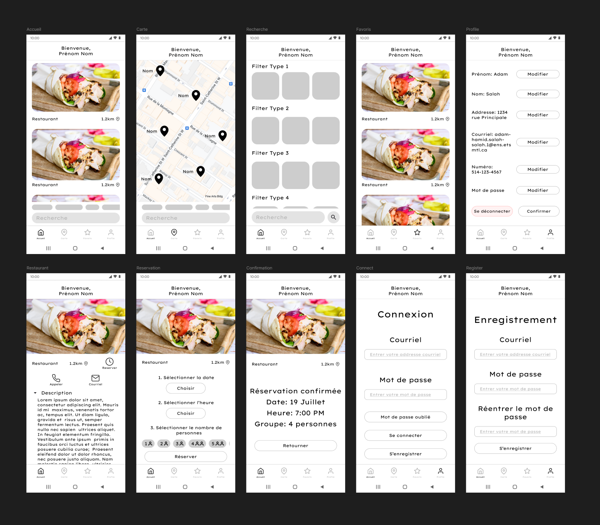
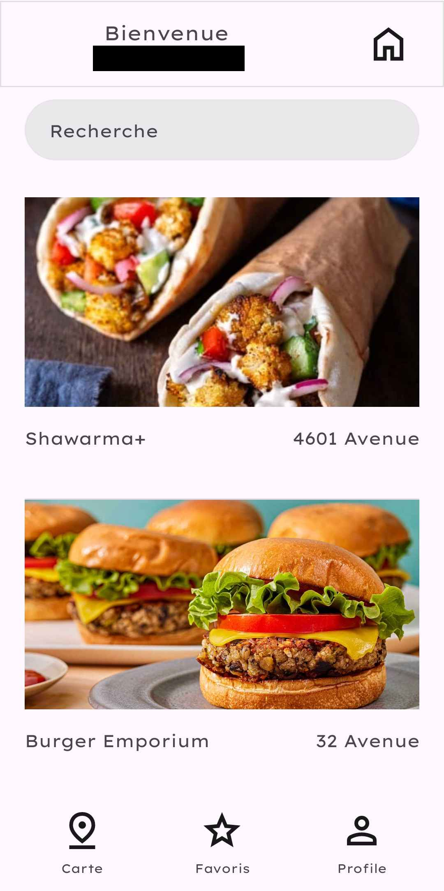
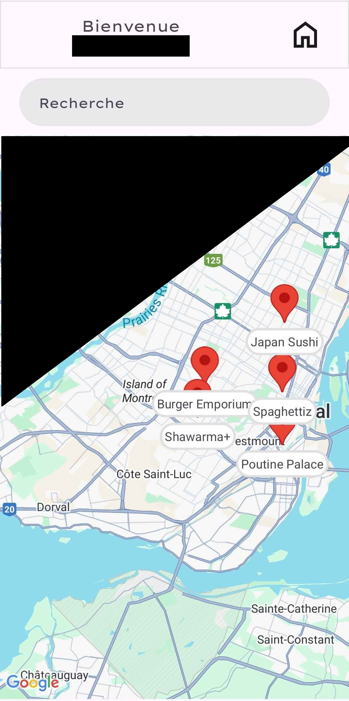
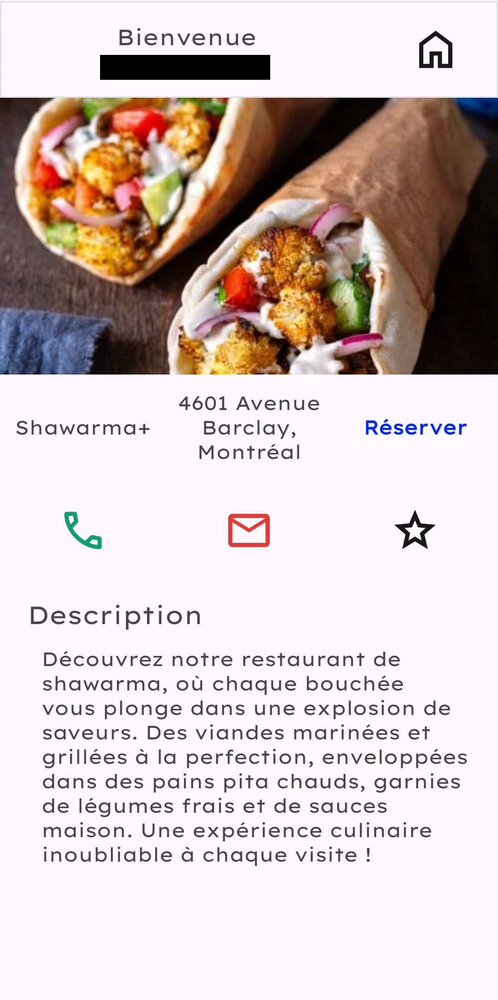

This was my first project where I had to work with a team. For 4 months, I got to work with 4 other developpers (my classmates in this case). 2 of them were tasked with creating the database and backend architechture and 2 were building the website. I worked on the mobile side of things by myself.

It was my first time working with Android (outside of a learning setting). I got to cover a lot of the developpment process. Here's a summary of what I learned and applied during the project.

## Software design and modeling

During that semester, I was learning the basics of software design and UML modeling. I used my knowledge on the matter during this project to make sure that I wouldn't overcomplicate my work. Since I was working alone on my part, I didn't have outside input on my programming. As such, I made sure to know what I wanted the result to be like before I started getting deep into the coding the systems.

## Programming

I used Java to program the application, as it was the language I was most familiar with at the time. It wasn't an easy task, as there is a lot to learn from the Android dev documentation just to implement basic features you see on every mobile app. The first hurdle I reached was figuring out how to integrate the Google Maps API into my application. It was my first time working with APIs and I chose Google's for two main reasons.

1. The documentation is plentiful, so I wouldn't have to dig through examples and blogs to figure out how to use certain features.
2. I wouldn't need to worry about credits. Since this project was made in an academic setting, we didn't release it to the public. Therefore, our API credit usage was kept low.

Another part of the problem was figuring out the best way to handle map markers. I decided to draw them relative to the map's screen projection coordinates.

The second hurdle I had to face was with the database. My teammates couldn't deploy the database in time for the project showcase, so I had to quickly craft a solution to have something to show. I decided to go with SQLite, as I could easily integrate it locally. It took me some time to figure out how to set it up, but after that it was smooth sailing. Since the database had already been designed by my teammates, I just had to adapt their SQL code and connect it to the rest of my application.

## UI design

In the same vein, I didn't want to start building the UI without having a full prototype. I used [Figma](https://www.figma.com/files/team/1369372511904256955/recents-and-sharing?fuid=1369372507615014223) for that purpose. It's a lot easier to make modifications in a program like Figma than [Android Studio](https://developer.android.com/studio). It also made it so I could experiment with a lot of different styles before settling on one. In the end, I kept a really minimalistic style so I could spend more time on the programming the systems.

 

## Agile

This project was made for a class on project management
. One of the requirements was to use the SCRUM Agile method to manage our work. We got to experience all of the different roles throughout the semester. Each week, a new person was Project Manager, SCRUM Master, etc. We used Jira to oversee our tasks and control our general workflow. We had daily standups and weekly meetings to discuss our work.

## Images

Here are some images from the project showcase! :)

 

 

 
