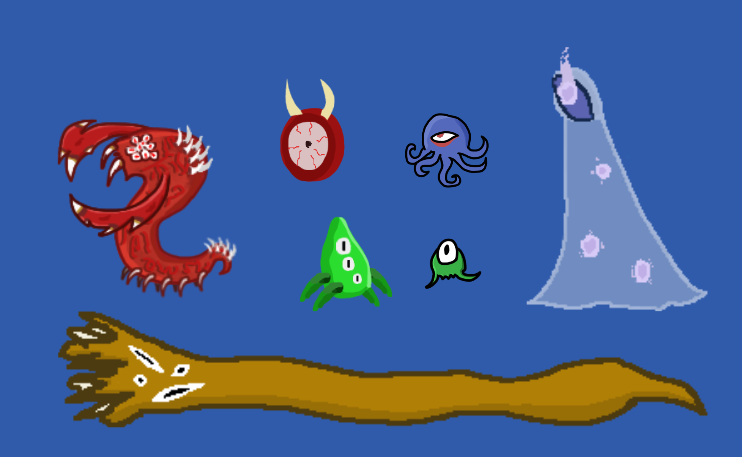
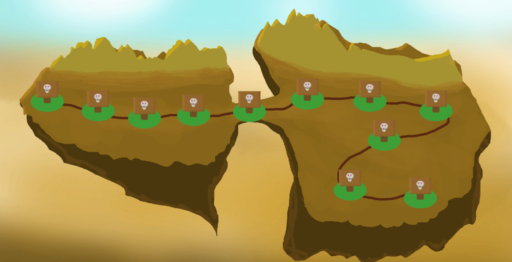

Ceci est un projet en cours réalisé avec le club de développement de jeux vidéo de mon université, [Conjure](https://conjure.etsmtl.ca/).

Gather and Defend est un mélange entre le style de jeu de *Plants vs Zombies* et la gestion de ressources de *Age of Empires*. Il faut placer des unités sur une grille afin de se défendre contre des hordes de monstres. On peut placer des unités offensives ou des unités qui collectent des ressources. Il faut gérer quelles ressources prioriser pour améliorer les unités qui s’adaptent le mieux à sa stratégie.

Pour le moment, on a 16 unités et 7 monstres, soit environ la moitié de ce qu'on prévoit d’implémenter pour la sortie du jeu. Bien sûr, certaines unités possèdent des mécaniques plus complexes que d’autres et demandent plus de temps et de ressources à développer. Par exemple, on cherche à implémenter un type spécial d’unité appelé « unité maudite », qui nécessitera une toute nouvelle ressource pour être créée. Ces unités auraient également des mécaniques de combat spéciales, qui pourraient nécessiter de se détacher de certains systèmes existants.

Le jeu suit une progression linéaire : chaque victoire débloque un nouveau niveau. Il y a 3 îles, qui servent de « mondes ». Chaque île possède un thème différent, des monstres uniques et parfois de nouvelles mécaniques qui augmentent la difficulté au fur et à mesure qu'on progresse.

Pour le style artistique, on a opté pour un style « programmeur », car on n'a pas beaucoup d’artistes dans le club. J’ai pris beaucoup de plaisir à concevoir des modèles d’unités temporaires pour présenter mon travail avant de finaliser les « sprites » définitifs. Les compétences créatives sont tout aussi importantes que les compétences techniques dans le développement de jeux vidéo !
